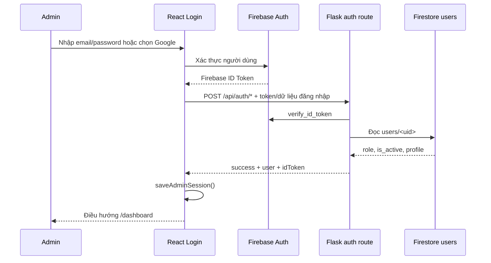
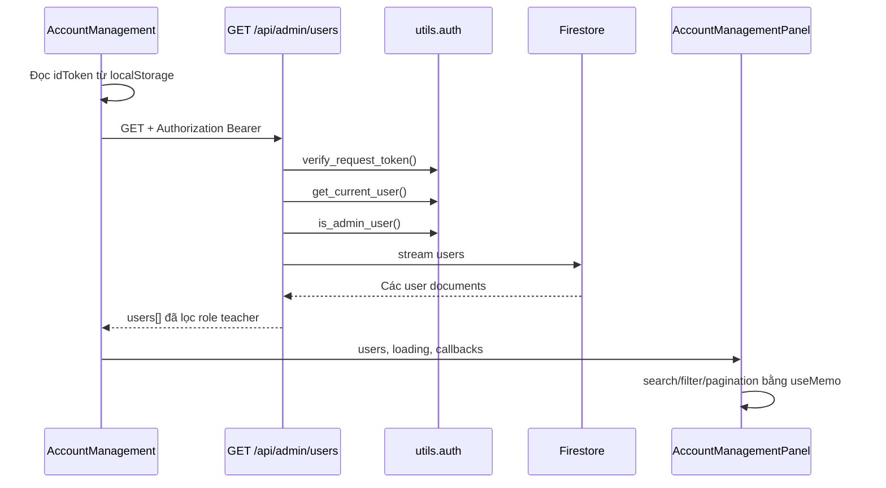
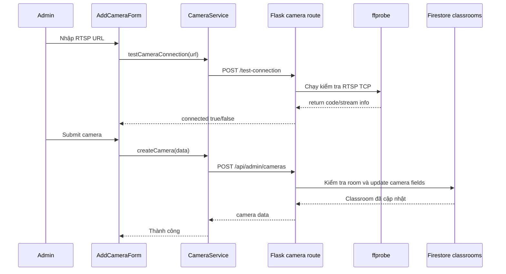

# PrivateClass Vision

## 1. Tổng quan

PrivateClass Vision là hệ thống cổng quản trị phục vụ quản lý lớp học, giáo viên, camera giám sát và các phiên học. Hệ thống được định hướng mở rộng thành nền tảng hỗ trợ giám sát lớp học bằng camera và các mô hình thị giác máy tính, trong đó quản trị viên có thể cấu hình dữ liệu vận hành từ một giao diện tập trung.

> Trạng thái hiện tại: phần giao diện quản trị đã được xây dựng tương đối đầy đủ; xác thực, quản lý giáo viên và quản lý camera đã có kết nối backend/Firebase. Một số dữ liệu lớp học, phiên học, dashboard giám sát và cảnh báo hiện vẫn là dữ liệu mẫu hoặc chưa có API hoàn chỉnh.

## 2. Mục tiêu hệ thống

- Cung cấp cổng quản trị dành cho `admin` và `super_admin`.
- Xác thực quản trị viên bằng Firebase Authentication.
- Lưu trữ tài khoản, lớp học và cấu hình camera trên Cloud Firestore.
- Quản lý danh sách giáo viên, trạng thái hoạt động và bộ môn.
- Liên kết mỗi phòng học với một camera RTSP.
- Kiểm tra khả năng kết nối RTSP thông qua `ffprobe`.
- Chuẩn bị nền tảng dữ liệu cho các chức năng giám sát lớp học và phân tích hành vi bằng computer vision.

## 3. Kiến trúc tổng thể

```text
React + Vite frontend  <---- HTTP/JSON + Bearer ID Token ---->  Flask API backend
       |                                                               |
       v                                                               v
Firebase Authentication                                      Firebase Admin SDK
                                                                       |
                                                                       v
                                                               Cloud Firestore
                                                                       |
                                                                       v
                                                               ffprobe / RTSP
```

### Thành phần chính

| Thành phần | Công nghệ | Vai trò |
|---|---|---|
| Frontend | React 19, Vite, React Router, Firebase Web SDK | Giao diện đăng nhập và cổng quản trị |
| Backend | Python, Flask, Flask-CORS | REST API và kiểm tra quyền truy cập |
| Xác thực | Firebase Authentication | Google Sign-In, email/mật khẩu, Firebase ID Token |
| Cơ sở dữ liệu | Cloud Firestore | Lưu người dùng, lớp học và cấu hình camera |
| Kiểm tra camera | FFmpeg `ffprobe` | Kiểm tra RTSP stream và cập nhật trạng thái camera |

## 4. Cấu trúc thư mục

```text
PrivateClass-Vision/
|-- backend/
|   |-- app.py                         # Flask application
|   |-- firebase_config.py              # Firebase Admin SDK và Firestore
|   |-- requirements.txt                # Python dependencies
|   |-- serviceAccountKey.json          # Khóa Firebase, không commit công khai
|   |-- routes/
|   |   |-- auth_routes.py              # Đăng nhập
|   |   |-- admin_routes.py             # Quản lý giáo viên
|   |   |-- camera_routes.py            # Quản lý camera RTSP
|   |-- utils/auth.py                   # Xác thực token và kiểm tra quyền
|-- camera-test/
|   |-- videos/                         # Video thử nghiệm hiện có
|-- frontend/
|   |-- package.json
|   |-- src/
|       |-- App.jsx                     # Khai báo route
|       |-- firebase.js                 # Firebase client config
|       |-- pages/                      # Các màn hình quản trị
|       |-- components/                 # UI theo nhóm chức năng
|       |-- services/                   # Gọi API frontend
|       |-- utils/AuthSession.js        # Quản lý phiên admin
|       |-- styles/                     # CSS theo màn hình
```

## 5. Chức năng đã triển khai

### 5.1. Đăng nhập và phiên quản trị

- Đăng nhập bằng email và mật khẩu thông qua Firebase Identity Toolkit.
- Đăng nhập Google bằng Firebase popup.
- Backend xác minh Firebase ID Token trước khi trả quyền truy cập.
- Chỉ tài khoản có role `admin` hoặc `super_admin` và đang hoạt động mới được vào cổng quản trị.
- Lưu thông tin người dùng, ID Token và thời điểm hết hạn trong `localStorage`.
- Phiên frontend có thời lượng hiện tại là 30 phút.
- Tự động chuyển về `/login` nếu phiên không tồn tại hoặc đã hết hạn.
- Có chức năng đăng xuất Firebase và xóa dữ liệu phiên cục bộ.

### 5.2. Dashboard

Route: `/dashboard`

- Hiển thị tổng số giáo viên.
- Thống kê giáo viên đang hoạt động và đã vô hiệu hóa.
- Tổng hợp bộ môn từ dữ liệu giáo viên.
- Có nút làm mới dữ liệu.
- Hiển thị khu vực phiên giám sát, cảnh báo và hoạt động gần đây ở mức giao diện.

> Các số liệu giám sát, cảnh báo và hoạt động trong dashboard hiện còn là dữ liệu mẫu hoặc dữ liệu dựng từ frontend, chưa phải dữ liệu phân tích thời gian thực.

### 5.3. Quản lý giáo viên

Route: `/account-management`

- Lấy danh sách người dùng có role `teacher` từ Firestore.
- Tìm kiếm theo họ tên, email và số điện thoại.
- Lọc theo bộ môn và trạng thái hoạt động.
- Phân trang, xem chi tiết và làm mới danh sách.
- Thêm giáo viên mới với họ tên, email, số điện thoại, bộ môn, role và trạng thái.
- Chỉnh sửa họ tên, số điện thoại, bộ môn và `is_active`.
- Xóa giáo viên.
- Nếu tài khoản có đồng thời role `parent`, hệ thống chỉ xóa role `teacher` và giữ lại tài khoản phụ huynh.

### 5.4. Quản lý camera

Route: `/camera-management`

- Hiển thị các camera được lưu trong dữ liệu `classrooms`.
- Tìm kiếm theo tên camera, mã camera, tên phòng và địa chỉ IP.
- Lọc theo phòng và trạng thái `online`/`offline`.
- Thống kê tổng số camera, camera online, offline và chưa cấu hình đủ thông tin.
- Thêm camera vào phòng học với `room_id`, tên camera, địa chỉ IP, RTSP port và RTSP URL.
- Không cho phép một phòng có nhiều camera theo logic hiện tại.
- Bắt buộc kiểm tra kết nối RTSP thành công trước khi hoàn tất thao tác thêm trên giao diện.
- Kiểm tra RTSP bằng `ffprobe` với timeout 10 giây.
- Cấu hình lại trạng thái camera online/offline.
- Xóa thông tin camera khỏi phòng học nhưng không xóa phòng học.

### 5.5. Quản lý lớp học

Route: `/class-management`

- Hiển thị danh sách lớp.
- Tìm kiếm theo tên lớp hoặc mã lớp.
- Phân trang.
- Có khung xem chi tiết lớp và các khu vực dự kiến cho tình trạng sức khỏe/giám sát.

> Danh sách lớp hiện đang được khai báo trực tiếp trong component. Chức năng CRUD lớp học, liên kết giáo viên, sĩ số và chỉ số sức khỏe chưa được nối hoàn chỉnh với backend.

### 5.6. Quản lý phiên học

Routes: `/session-management`, `/session-management/:sessionId`

- Hiển thị lịch phiên học theo ngày.
- Có dữ liệu mẫu cho các trạng thái `completed`, `live` và `scheduled`.
- Lọc theo từ khóa, lớp, môn học, giáo viên và trạng thái.
- Hiển thị thời gian, phòng, giáo viên, môn học và chỉ số tập trung.
- Có giao diện tạo phiên và trang chi tiết phiên ở mức frontend.

> Dữ liệu phiên học hiện đang hard-code trong `SessionManagementPanel.jsx`. Chưa có API lưu, sửa, xóa, bắt đầu/kết thúc phiên hoặc đồng bộ kết quả phân tích từ camera.

## 6. API backend hiện có

Base URL mặc định: `http://127.0.0.1:5000`

Tất cả endpoint quản trị yêu cầu header:

```http
Authorization: Bearer <FIREBASE_ID_TOKEN>
```

### Health check

| Method | Endpoint | Mô tả |
|---|---|---|
| `GET` | `/` | Kiểm tra Flask API đang hoạt động |

### Authentication

| Method | Endpoint | Mô tả |
|---|---|---|
| `POST` | `/api/auth/google` | Xác minh Google Firebase ID Token và cấp quyền admin |
| `POST` | `/api/auth/email-password` | Đăng nhập email/mật khẩu qua Firebase Identity Toolkit |

### Giáo viên và người dùng quản trị

| Method | Endpoint | Mô tả |
|---|---|---|
| `GET` | `/api/admin/users` | Lấy danh sách tài khoản có role giáo viên |
| `POST` | `/api/admin/teachers` | Tạo hồ sơ giáo viên |
| `PUT` | `/api/users/<uid>` | Cập nhật hồ sơ và trạng thái giáo viên |
| `DELETE` | `/api/admin/teachers/<uid>` | Xóa giáo viên hoặc chỉ xóa role giáo viên |

### Camera

| Method | Endpoint | Mô tả |
|---|---|---|
| `GET` | `/api/admin/cameras` | Lấy camera từ các phòng học |
| `POST` | `/api/admin/cameras` | Thêm camera vào phòng học |
| `POST` | `/api/admin/cameras/test-connection` | Kiểm tra RTSP URL |
| `PUT` | `/api/admin/cameras/<camera_id>/configure` | Kiểm tra và cập nhật trạng thái camera |
| `DELETE` | `/api/admin/cameras/<camera_id>` | Xóa cấu hình camera khỏi phòng |

Response API sử dụng dạng thống nhất ở mức cơ bản:

```json
{
  "success": true,
  "message": "...",
  "data": "..."
}
```

Một số endpoint sử dụng khóa chuyên biệt như `users`, `cameras`, `user` hoặc `camera` thay cho `data`.

## 7. Mô hình dữ liệu Firestore dự kiến

### Collection `users`

```json
{
  "uid": "firebase-auth-uid",
  "email": "teacher@example.com",
  "name": "Nguyen Van A",
  "phone_number": "0900000000",
  "subject": "Toan",
  "role": ["teacher"],
  "active_role": "teacher",
  "is_active": true,
  "auth_provider": "google",
  "auth_status": "pending",
  "create_date": "timestamp"
}
```

### Collection `classrooms`

Một phòng học có thể mang các trường camera:

```json
{
  "class_name": "10A1",
  "camera_name": "Camera P101",
  "ip_address": "192.168.1.100",
  "rtsp_port": "554",
  "rtsp_url": "rtsp://...",
  "status": "online"
}
```

Hiện tại API camera dùng `classrooms/<room_id>` làm nơi lưu cấu hình camera thay vì một collection `cameras` riêng.

### Các collection nên bổ sung

- `sessions`: lịch và trạng thái phiên học.
- `session_events`: sự kiện trong phiên, timestamp và nguồn camera.
- `attendance`: điểm danh theo phiên/lớp.
- `vision_results`: kết quả nhận diện, mức tập trung và cảnh báo.
- `activity_logs`: lịch sử thao tác quản trị.

## 8. Hướng dẫn cài đặt và chạy

### Yêu cầu môi trường

- Windows.
- Python 3.10+ được khuyến nghị.
- Node.js 18+ và npm.
- Một Firebase project có Authentication và Cloud Firestore.
- `ffprobe.exe` nếu muốn kiểm tra camera RTSP.

### Cấu hình Firebase

1. Đặt service account JSON vào `backend/serviceAccountKey.json`.
2. Kiểm tra Firebase Web SDK config trong `frontend/src/firebase.js`.
3. Bật các phương thức đăng nhập cần dùng trong Firebase Authentication.
4. Tạo dữ liệu quản trị viên trong collection `users` với role `admin` hoặc `super_admin` và `is_active: true`.
5. Kiểm tra Firestore có các collection `users` và `classrooms`.

> Không đưa `serviceAccountKey.json`, API key hoặc thông tin bí mật lên GitHub. Nên chuyển toàn bộ cấu hình sang biến môi trường trước khi triển khai thật.

### Chạy backend

```powershell
cd backend
python -m venv .venv
.\.venv\Scripts\Activate.ps1
pip install -r requirements.txt
python app.py
```

Backend chạy mặc định tại `http://127.0.0.1:5000`.

### Chạy frontend

Mở terminal khác:

```powershell
cd frontend
npm install
npm run dev
```

Vite sẽ in URL frontend trong terminal, thường là `http://localhost:5173`.

### Kiểm tra chất lượng frontend

```powershell
cd frontend
npm run lint
npm run build
```

## 9. Luồng nghiệp vụ chính

### Luồng đăng nhập

1. Người dùng nhập email/mật khẩu hoặc chọn Google.
2. Firebase cấp ID Token.
3. Frontend gửi token đến backend.
4. Backend xác minh token và tra user tương ứng trong Firestore.
5. Backend kiểm tra role và `is_active`.
6. Frontend lưu phiên và chuyển đến dashboard.

### Luồng thêm camera

1. Admin mở quản lý camera và chọn phòng học.
2. Nhập thông tin mạng và RTSP URL.
3. Frontend gọi endpoint kiểm tra kết nối.
4. Backend chạy `ffprobe` qua RTSP TCP.
5. Nếu kết nối thành công, frontend cho phép thêm camera.
6. Backend cập nhật thông tin camera vào document phòng học.

## 10. Các giới hạn và việc cần hoàn thiện

- Cấu hình API đang hard-code `127.0.0.1:5000` ở frontend.
- Firebase API key và service account chưa được quản lý bằng biến môi trường.
- Chưa có refresh token/session strategy hoàn chỉnh; frontend chỉ kiểm tra thời hạn cục bộ 30 phút.
- Dashboard chưa lấy dữ liệu phiên, cảnh báo và phân tích từ backend.
- Quản lý lớp học chưa có API CRUD.
- Quản lý phiên học chưa có persistence và API.
- Chưa có pipeline nhận video, xử lý frame hoặc lưu kết quả computer vision.
- Chưa có phân quyền chi tiết giữa `admin` và `super_admin` ngoài việc cùng được xem các API quản trị.
- Chưa có audit log, rate limiting và cơ chế quan sát lỗi tập trung.
- Cần chuẩn hóa response schema giữa các endpoint.
- Cần bổ sung test tự động cho API, quyền truy cập và các luồng frontend.
- Đường dẫn `ffprobe` hiện phụ thuộc máy phát triển Windows cụ thể.

## 11. Lộ trình phát triển đề xuất

### Giai đoạn 1: Củng cố nền tảng

- Chuyển cấu hình Firebase, API URL và đường dẫn FFmpeg sang `.env`.
- Thêm `.gitignore` cho secret, môi trường ảo, `node_modules` và file build.
- Chuẩn hóa service frontend và tên file theo một quy ước thống nhất.
- Bổ sung schema validation cho request/response.
- Viết unit test cho authorization, CRUD giáo viên và camera.
- Bổ sung logging, xử lý lỗi và tài liệu API bằng OpenAPI/Swagger.

### Giai đoạn 2: Hoàn thiện quản lý trường học

- Xây dựng API CRUD lớp học, phòng học, giáo viên và môn học.
- Liên kết giáo viên với lớp và thời khóa biểu.
- Thiết kế collection `sessions` và lưu phiên học thật.
- Thêm trạng thái vòng đời phiên: `scheduled`, `live`, `completed`, `cancelled`.
- Thêm điểm danh và thống kê sĩ số.

### Giai đoạn 3: Nền tảng camera và xử lý video

- Xây dựng service quản lý kết nối camera ổn định, retry và health check định kỳ.
- Tách camera thành collection riêng nếu cần quản lý nhiều camera/phòng.
- Thêm worker nhận RTSP và ghi lại metadata stream.
- Thiết kế hàng đợi xử lý frame để tránh xử lý trực tiếp trong request Flask.
- Lưu snapshot hoặc clip sự kiện theo chính sách lưu trữ và quyền truy cập.

### Giai đoạn 4: Computer vision và giám sát

- Xác định rõ bài toán: điểm danh, phát hiện vắng mặt, mức tập trung, hành vi bất thường hoặc an toàn lớp học.
- Chọn và đánh giá mô hình trên tập dữ liệu phù hợp với điều kiện camera thực tế.
- Lưu kết quả theo phiên, lớp, camera và thời điểm.
- Xây dựng cảnh báo theo ngưỡng, mức độ và trạng thái đã xử lý.
- Hiển thị biểu đồ xu hướng, timeline sự kiện và báo cáo sau phiên.

### Giai đoạn 5: Sẵn sàng triển khai

- Đóng gói backend/frontend bằng Docker hoặc quy trình CI/CD.
- Dùng HTTPS, secret manager và tài khoản dịch vụ có quyền tối thiểu.
- Thiết lập backup Firestore và chính sách retention video.
- Thêm monitoring, health check, metrics và cảnh báo vận hành.
- Kiểm thử tải với nhiều camera đồng thời.
- Rà soát quyền riêng tư, đồng thuận sử dụng hình ảnh và thời hạn lưu dữ liệu học sinh.

## 12. Tiêu chí hoàn thành phiên bản sản xuất

- Không còn secret hard-code trong repository.
- Tất cả dữ liệu hiển thị trên dashboard, lớp học và phiên học lấy từ API thật.
- Có test cho các quyền `401`, `403`, dữ liệu không hợp lệ và lỗi phụ thuộc ngoài.
- Camera có health check định kỳ và trạng thái được cập nhật tự động.
- Có cơ chế xử lý bất đồng bộ cho pipeline video/computer vision.
- Có audit log cho thao tác quản trị.
- Có tài liệu triển khai, backup/restore và xử lý sự cố.
- Có chính sách bảo mật và bảo vệ dữ liệu phù hợp môi trường trường học.

## 13. Tài liệu đọc code chi tiết

Phần này mô tả code theo đúng hướng dữ liệu chạy qua hệ thống: khởi động ứng dụng, xác thực, route, page, component, service và dữ liệu Firestore.

### 13.1. Backend: điểm khởi động

#### `backend/app.py`

Đây là entry point của Flask:

1. Tạo đối tượng `Flask`.
2. Bật `CORS(app)` để frontend chạy ở port khác có thể gọi API.
3. Đăng ký ba blueprint:
   - `auth_bp`: `/api/auth/...`.
   - `admin_bp`: danh sách và CRUD giáo viên.
   - `camera_bp`: CRUD camera và kiểm tra RTSP.
4. Cung cấp `GET /` để kiểm tra server.
5. Chuẩn hóa lỗi `404`, `405` và `500` thành JSON.
6. Khi chạy trực tiếp bằng `python app.py`, server bind tại `127.0.0.1:5000` và bật debug.

Backend không có lớp controller/service riêng; logic xác thực, đọc Firestore và tạo response hiện nằm trực tiếp trong các route function.

#### `backend/firebase_config.py`

File này được import khi các route cần `db`, vì vậy Firebase được khởi tạo trong quá trình import module:

- `credentials.Certificate("serviceAccountKey.json")` đọc service account tương đối theo thư mục chạy process.
- `firebase_admin.initialize_app(cred)` khởi tạo Firebase Admin SDK.
- `firestore.client()` tạo client Firestore dùng chung.
- `FIREBASE_API_KEY` được dùng cho Firebase Identity Toolkit khi đăng nhập email/mật khẩu.

Hệ quả: chạy backend từ thư mục khác có thể làm đường dẫn service account không tồn tại; file này cũng đang chứa thông tin cấu hình nhạy cảm và nên được chuyển sang biến môi trường.

#### `backend/test_firebase.py`

Đây là smoke test tối giản. File chỉ import `firebase_config`; nếu import thành công thì Firebase Admin SDK và Firestore client đã được tạo. File chưa thực hiện truy vấn dữ liệu hoặc assertion.

### 13.2. Backend: lớp xác thực dùng chung

#### `backend/utils/auth.py`

Các hằng số:

- `ADMIN_ROLES = {"admin", "super_admin"}`.
- `TEACHER_ROLE = "teacher"`.

`verify_request_token()` thực hiện:

1. Đọc header `Authorization`.
2. Kiểm tra header bắt đầu bằng `Bearer `.
3. Tách ID Token.
4. Gọi `firebase_admin.auth.verify_id_token`.
5. Trả decoded token nếu hợp lệ, hoặc `None` nếu thiếu/sai/hết hạn.

Hàm này chỉ xác minh token Firebase; nó chưa kiểm tra document `users` và chưa kiểm tra role.

`get_current_user(decoded_token)` lấy `uid` từ decoded token, đọc `users/<uid>` và trả về cả document reference lẫn dictionary dữ liệu. Nếu user document không tồn tại, hàm trả `(None, None)`.

`is_admin_user(user_data)` kiểm tra role thuộc `ADMIN_ROLES` và `is_active` không phải `False`. Trong code hiện tại hàm này kỳ vọng role là string; các route camera có logic riêng hỗ trợ cả string và list.

`get_json_body()` dùng `request.get_json(silent=True) or {}` để request JSON lỗi không làm Flask ném exception.

`normalize_subjects()` kiểm tra subjects là list và loại bỏ phần tử rỗng, nhưng hiện chưa được sử dụng trong route cập nhật giáo viên; đây là dấu hiệu logic subject đang chưa thống nhất.

### 13.3. Backend: xác thực người dùng

#### `backend/routes/auth_routes.py`

`auth_bp` cung cấp hai endpoint.

##### `POST /api/auth/google`

Request:

```json
{ "idToken": "<Firebase ID Token>" }
```

Luồng xử lý:

1. Đọc `idToken` từ JSON.
2. Gọi `auth.verify_id_token(idToken)`.
3. Lấy `uid`.
4. Đọc `users/<uid>` từ Firestore.
5. Từ chối nếu user chưa có document, role không phải admin hoặc user bị vô hiệu hóa.
6. Trả thông tin tối thiểu của admin.

Mã lỗi chính: `400` khi thiếu token, `401` khi token sai, `403` khi user không có quyền.

##### `POST /api/auth/email-password`

Request:

```json
{ "email": "admin@example.com", "password": "secret" }
```

Luồng xử lý khác với Google login:

1. Kiểm tra email và password ở backend.
2. Gửi request đến Firebase Identity Toolkit `signInWithPassword` bằng `FIREBASE_API_KEY`.
3. Đọc `idToken` Firebase từ response.
4. Verify lại token bằng Firebase Admin SDK.
5. Tra `users/<uid>` và kiểm tra role/trạng thái.
6. Trả `idToken` cùng object `user` cho frontend lưu phiên.

Các lỗi Firebase như `INVALID_PASSWORD`, `EMAIL_NOT_FOUND` được gom thành thông báo sai email/mật khẩu; `USER_DISABLED` trả `403`; lỗi kết nối Firebase trả `503`.

### 13.4. Backend: quản lý giáo viên

#### `backend/routes/admin_routes.py`

Mỗi route giáo viên đều thực hiện cùng lớp kiểm tra:

1. `verify_request_token()` xác minh Bearer token.
2. `get_current_user()` tìm admin trong Firestore.
3. `is_admin_user()` kiểm tra role và trạng thái.
4. Thực hiện thao tác Firestore.

##### `GET /api/admin/users`

Đọc toàn bộ collection `users`, chuyển role string thành list nếu cần, chỉ giữ document có role `teacher`, rồi map về các field `id`, `uid`, `email`, `name`, `phone_number`, `role`, `is_active`, `subject`, `create_date`, `active_role`.

Đây là lý do dashboard và trang account management dùng cùng một API. Bộ lọc tìm kiếm, bộ môn, trạng thái và phân trang không chạy ở backend; chúng chạy trong `AccountManagementPanel`.

##### `POST /api/admin/teachers`

Route nhận name, email, phone number, subject, role và `is_active`:

1. Chuẩn hóa chuỗi bằng `strip()`; email chuyển lowercase.
2. Bắt buộc name, email và subject.
3. Chỉ cho phép tạo role chính `teacher`; nếu request có `parent` thì thêm role `parent`.
4. Kiểm tra `is_active` phải là boolean.
5. Query email để tránh trùng.
6. Tạo document có ID bằng email.

Document mới đặt `uid: None`, `auth_provider: "google"` và `auth_status: "pending"`. Route này tạo hồ sơ Firestore, chưa gọi `auth.create_user`, nên chưa tự tạo tài khoản Firebase Authentication.

##### `PUT /api/users/<uid>`

Route đọc document theo `<uid>`, xác nhận document có role `teacher`, sau đó chỉ cập nhật các field được gửi trong request:

- `name`: không được rỗng.
- `phone_number`: được phép rỗng.
- `subject`: không được rỗng.
- `is_active`: bắt buộc boolean.

Nếu không có field hợp lệ để cập nhật, route trả `400`. Email và role không được cập nhật bởi endpoint này.

##### `DELETE /api/admin/teachers/<uid>`

Nếu tài khoản có cả `teacher` và `parent`, route chỉ loại `teacher` khỏi mảng role và đổi `active_role` thành `parent`. Nếu chỉ có role teacher, route cố gắng xóa Firebase Auth user rồi xóa Firestore document. `UserNotFoundError` được bỏ qua để thao tác xóa Firestore vẫn hoàn tất.

### 13.5. Backend: quản lý camera và RTSP

#### `backend/routes/camera_routes.py`

`authorize_admin()` là lớp bảo vệ riêng của camera:

1. Đọc Bearer token.
2. Verify token.
3. Đọc user document theo UID.
4. Hỗ trợ role dạng string hoặc list.
5. Chấp nhận `admin` hoặc `super_admin`.
6. Từ chối user bị vô hiệu hóa.

`build_camera_data(doc)` là mapper từ document `classrooms` sang response camera. `camera_id`, `id` và `room_id` đều lấy từ `doc.id`; status mặc định là `offline`; `is_configured` là kết quả `all()` của bốn field camera.

##### Tạo camera

`POST /api/admin/cameras` nhận `room_id`, `camera_name`/`name`, `ip_address`, `rtsp_port`, `rtsp_url`. Route xác nhận phòng tồn tại và chưa có `camera_name`, sau đó update chính document phòng học với thông tin camera và status `offline`.

##### Lấy camera

`GET /api/admin/cameras` stream toàn bộ `classrooms`, bỏ qua phòng không có bất kỳ field camera nào, rồi map các document còn lại bằng `build_camera_data()`.

##### Kiểm tra kết nối

`POST /api/admin/cameras/test-connection` nhận `rtsp_url`, sau đó gọi process ngoài:

```text
ffprobe -v error -rtsp_transport tcp
    -show_entries stream=codec_name,width,height,r_frame_rate
    -of json <rtsp_url>
```

Process có timeout 10 giây. Return code khác 0 hoặc timeout được trả dưới dạng response nghiệp vụ `success: true, connected: false`; đây là lỗi kết nối camera chứ không phải lỗi API.

##### Configure và delete

`PUT /api/admin/cameras/<camera_id>/configure` đọc RTSP URL đã lưu, chạy lại ffprobe và update `status` thành `online` hoặc `offline`.

`DELETE /api/admin/cameras/<camera_id>` dùng `firestore.DELETE_FIELD` để xóa các field camera khỏi classroom, giữ nguyên document phòng học.

### 13.6. Frontend: bootstrap và routing

#### `frontend/src/main.jsx`

Render React root trong `React.StrictMode`, bọc bởi `BrowserRouter`, rồi render `App`. CSS tổng cấp được import từ `styles/index.css`.

#### `frontend/src/App.jsx`

`ProtectedRoute` gọi `getAdminSession()` ở mỗi lần render route. Nếu không có session, nó xóa session cũ và dùng `<Navigate>` chuyển đến `/login`.

Các route công khai:

- `/login`.

Các route bảo vệ:

- `/dashboard`.
- `/account-management`.
- `/camera-management`.
- `/class-management`.
- `/session-management`.
- `/session-management/:sessionId`.

Route `/` và route không khớp đều redirect đến `/login`.

#### `frontend/src/firebase.js`

Khởi tạo Firebase Web SDK từ object cấu hình, export `auth` cho email/password và `signInWithPopup`, export `googleProvider` cho Google login. Analytics đang được comment out.

### 13.7. Frontend: session localStorage

#### `frontend/src/utils/AuthSession.js`

`saveAdminSession(user, idToken)` tính `expiresAt = Date.now() + 30 phút`, sau đó lưu ba key:

- `adminUser`: JSON của user.
- `idToken`: Firebase ID Token.
- `sessionExpiresAt`: timestamp dạng string.

`getAdminSession()` yêu cầu đủ cả ba key, kiểm tra hết hạn, parse JSON và trả object session. Nó không gọi server để xác minh token mới.

`logoutAdmin(navigate)` gọi `signOut(auth)`, luôn xóa localStorage kể cả khi Firebase signOut lỗi, sau đó điều hướng về login.

### 13.8. Frontend: authentication UI

#### `pages/Login.jsx`, `components/auth/LoginForm.jsx`

`Login` tạo callback `handleLogin` để điều hướng `/dashboard`. `LoginForm` bao gồm phần chào mừng, `GoogleLoginForm` và thông báo bảo mật.

#### `components/auth/GoogleLoginForm.jsx`

Tên component mang tính lịch sử nhưng thực hiện cả hai hình thức đăng nhập:

- Email/password: POST `/api/auth/email-password`.
- Google: Firebase `signInWithPopup`, lấy `user.getIdToken()`, sau đó POST `/api/auth/google`.

Khi backend trả success, form gọi `saveAdminSession()` rồi callback `onLogin`. Loading và error được giữ bằng `useState`; lỗi email hiển thị trong form, lỗi Google hiện bằng `alert`.

### 13.9. Frontend: layout dùng chung

#### `components/admin/AdminSidebar.jsx`

Danh sách `navigationItems` là cấu hình menu. Item enabled sẽ gọi `navigate(path)`; item disabled bị chặn cả bằng thuộc tính HTML `disabled` và guard trong `handleNavigation`. Các mục đang tắt: activity log, help và settings.

#### `components/admin/AdminHeader.jsx`

Khi mount, component đọc `adminUser`/`idToken` từ localStorage. Tên admin được dùng để render lời chào, avatar chữ cái đầu và nút profile. Click profile mở `AdminProfileModal`; sau khi save, state local được cập nhật.

#### `components/common/Button.jsx`, `Input.jsx`, `Icon.jsx`

Đây là các component UI dùng lại cho nút, input và icon. `Icon` nhận tên icon và kích thước để các panel không phải tự định nghĩa markup icon lặp lại.

### 13.10. Frontend: dashboard

`pages/DashBoard.jsx` là container:

1. Đọc ID Token từ localStorage.
2. Gọi `GET /api/admin/users` khi mount.
3. Lưu users vào state.
4. Truyền users/loading/callback refresh cho `DashboardPanel`.

`DashboardPanel.jsx` tính tại frontend:

- `totalTeachers = users.length`.
- `activeTeachers`: user có `is_active !== false`.
- `inactiveTeachers`: user có `is_active === false`.
- `subjects`: tập hợp subject từ các user có subject dạng array.

Các mảng `monitoringSessions`, `alerts`, `activities` đang được tạo cố định trong component. Vòng tròn mức độ tập trung chưa có dữ liệu thật.

### 13.11. Frontend: quản lý giáo viên

`pages/AccountManagement.jsx` giữ state server-side gồm `users` và `loading`, đồng thời là nơi gọi API:

- `fetchUsers()` gọi GET.
- `handleUpdateUser()` gọi PUT, cập nhật lại user trong state theo uid/id.
- `handleDeleteTeacher()` gọi DELETE rồi fetch lại danh sách.
- `handleLogout()` dùng helper session.

`AccountManagementPanel.jsx` nhận dữ liệu và xử lý phần hiển thị:

1. Lọc user có role teacher.
2. Chuẩn hóa field thiếu bằng giá trị mặc định.
3. Lọc search/subject/status bằng `useMemo`.
4. Cắt mảng theo trang, mỗi trang 10 giáo viên.
5. Mở modal thêm, sửa hoặc xem chi tiết.

`AddTeacherForm.jsx` kiểm tra name/email/subject ở client, tạo payload role `teacher` hoặc `teacher + parent`, rồi gọi callback `onSave`.

`EditTeacherForm.jsx` nạp dữ liệu teacher vào state khi prop thay đổi, cho sửa name/phone/subject/status và giữ email ở trạng thái disabled. Submit gọi `onSave` với uid.

### 13.12. Frontend: quản lý camera

`services/CameraService.jsx` là lớp API mỏng. Mỗi hàm đọc `idToken`, tạo request, parse JSON và ném `Error` nếu HTTP hoặc `success` thất bại:

- `getCameras()` -> GET.
- `testCameraConnection(rtspUrl)` -> POST.
- `createCamera(cameraData)` -> POST.
- `configureCamera(cameraId)` -> PUT.
- `deleteCamera(cameraId)` -> DELETE.

`CameraManagementPanel.jsx` là container/presenter kết hợp:

- `useEffect` gọi `loadCameras()` khi mount.
- `useMemo` tạo danh sách room filter và camera filter.
- State `configuringCameraId`/`deletingCameraId` khóa trạng thái loading theo từng dòng.
- Configure/delete đều gọi service rồi reload danh sách.
- Thêm camera được mở bằng `AddCameraForm`.

`AddCameraForm.jsx` đọc FormData, yêu cầu test RTSP thành công trước submit, sau đó gọi `onSubmit`. Vì vậy có hai bước tách biệt: test stream và ghi cấu hình classroom.

### 13.13. Frontend: lớp học và phiên học

`ClassManagementPanel.jsx` giữ mảng classes bằng `useState` nhưng dữ liệu được khai báo trực tiếp trong component. Search và pagination là logic frontend; các chỉ số `healthyClasses` và `attentionClasses` hiện có giá trị `0` cố định.

`SessionManagementPanel.jsx` cũng giữ sessions, classes, subjects, teachers và time slots bằng dữ liệu hard-code. Component cung cấp:

- Chọn/ngày trước/ngày sau.
- Lọc theo search, class, subject, teacher, status.
- Nhãn status bằng `getStatusLabel()`.
- CSS status bằng `getSessionStatusClass()`.
- Phân loại focus: từ 80 trở lên `good`, từ 60 đến dưới 80 `medium`, thấp hơn 60 `low`.
- Điều hướng đến chi tiết bằng React Router.

`SessionDetail.jsx` nhận sessions qua prop nhưng route hiện không truyền prop. Vì vậy component rơi về session mặc định nếu không tìm thấy dữ liệu. Nó tính thời lượng bằng chênh lệch phút giữa start/end; `focusedMinutes = duration * focus / 100` và phần còn lại là unfocused minutes.

### 13.14. CSS và tổ chức giao diện

Các file trong `frontend/src/styles` chia theo màn hình/chức năng:

- `variables.css`: biến màu và thông số dùng chung.
- `index.css`: style nền và import CSS.
- `admin-layout.css`, `admin-header.css`, `admin-sidebar.css`: khung quản trị.
- `login.css`: màn hình login.
- `dashboard.css`: dashboard.
- `account-management.css`: giáo viên và modal form.
- `camera-management.css`: camera.
- `class-management.css`: lớp học.
- `session-management.css`: danh sách/chi tiết phiên.
- `responsive.css`: breakpoint responsive.

CSS hiện dùng class name theo từng feature, không có CSS-in-JS. Component chịu trách nhiệm markup/state, còn style được gom trong file CSS tương ứng.

## 14. Sơ đồ luồng code

### 14.1. Đăng nhập



### 14.2. Lấy danh sách giáo viên



### 14.3. Thêm và kiểm tra camera



## 15. Các bất nhất kỹ thuật cần lưu ý

Đây là những điểm được suy ra trực tiếp từ code hiện tại, cần xử lý trước khi coi hệ thống là production-ready:

1. `App.jsx` khai báo route `/session-management/:sessionId`, nhưng `SessionDetail.jsx` đọc `useParams().id`; vì vậy URL parameter không được đọc đúng.
2. File service có tên `CameraService.jsx`, trong khi một số import dùng `cameraService` viết thường. Windows thường không lộ lỗi này, nhưng môi trường Linux phân biệt hoa thường sẽ fail build.
3. `POST /api/admin/teachers` tạo document có ID bằng email và `uid: None`, còn PUT/DELETE tìm document theo UID. Giáo viên mới có thể không cập nhật/xóa được nếu chưa có bước đồng bộ UID.
4. `auth_routes.py` kiểm tra `role not in ADMIN_ROLES` như một string; nếu admin lưu role dạng list thì đăng nhập bị từ chối, trong khi camera route đã hỗ trợ list.
5. `DashboardPanel.jsx` chỉ đếm subject nếu subject là array, trong khi API tạo/cập nhật giáo viên hiện thường lưu subject là string.
6. `normalize_subjects()` tồn tại nhưng chưa được dùng để chuẩn hóa dữ liệu subject.
7. `SessionDetail` có prop `sessions`, nhưng parent route không truyền danh sách sessions; dữ liệu chi tiết thực tế vì vậy đang fallback về record mặc định.
8. Frontend gọi trực tiếp nhiều URL `http://127.0.0.1:5000` thay vì dùng một API client/env chung.
9. Camera status được set `offline` khi tạo cấu hình; status không tự động health-check định kỳ mà chỉ đổi khi người dùng bấm configure.
10. Các thao tác tạo giáo viên, cập nhật và xóa vẫn dùng `alert`/`confirm`; chưa có lớp notification hoặc error boundary thống nhất.

## 16. Quy ước khi phát triển tiếp

- Mọi API quản trị phải xác minh token và role ở backend; không xem `ProtectedRoute` frontend là cơ chế bảo mật duy nhất.
- Không đưa secret, service account hoặc token vào source control.
- Dùng một `API_BASE_URL` từ biến môi trường cho toàn frontend.
- Trước khi thêm UI cho entity mới, thiết kế schema Firestore và API trước để tránh hard-code dữ liệu trong component.
- Tách logic gọi API khỏi component, ưu tiên mở rộng service layer hiện có.
- Thống nhất role là string hay array trên toàn backend/frontend.
- Thống nhất schema response và mã lỗi để frontend không phải xử lý từng endpoint theo cách khác nhau.
- Khi sửa route param, kiểm tra đồng thời `App.jsx`, `useParams()` và nơi gọi `navigate()`.
- Khi chạy trên Linux/CI, kiểm tra chính xác chữ hoa chữ thường của tên file import.
- Với pipeline video, không chạy xử lý dài trong request Flask; dùng worker/queue và lưu trạng thái job.